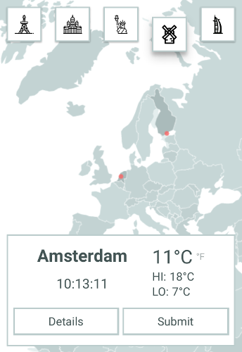

  

A simple one page mobile(portrait) first weather app.  
Try the [Demo](https://weather-a52d4.herokuapp.com/)!

### Tech stack

#### Vue
Animations in vue is a joy.

#### d3 & topojson
I wanted to have a map to visualize the world but I found google maps integration is very slow and unreliable especially on pans and zooms. It took me a while to find a replacement but d3-geo combined with topojson and earth svg data looked really impressive and didn't have the baggage of google maps.  

#### socket.io
To receive data in realtime

#### nedb
A lovely tiny local database with the mongodb api. Good for a quick prototype and easy to upgrade to the well scaling mongodb.

### UI & UX design choices
It was important that the ui is simple and not too crowded for mobiles. I wanted there to be three main actions; changing city, reading data and submitting data.

People are used to menus being in the top of their application so I wanted the city 'switch' to be there. Since there is only 5 locations I chose to show them all in a row with some icons to catch the eye. However if this were to scale larger we would need to think some other solution for this. Perhaps to be able to scroll the map and click on locations together with a search box.  

Submitting data is not something everyone might be interested in so it was a natural choice to put in a modal. At first I had the form be a select and a number input, this was problematic for one reason especially. The number input on a mobile opens the keyboard that makes the space on screen very small. This could be worked around but I think it would take some time to get it right. I found using a range input was a more elegant solution. I dropped the city select input completely and decided to have it be based on the location in the current view. This way the form became very simple and clean making it quick and easy to use.   

### Todo / excercise for the reader
Some things were purposefully not implemented to save time. Possible future improvements to the code could include the following:
-  Routing: have the url change by selected location and(or) state
-  Responsive css: add better views for desktop and small landscape devices
-  SEO: server side rendering and 'proper' html syntax
-  Backend: a proper api and schedule changes to location timezones, dynamic locations
-  Testing: I skipped testing completely to progress faster
-  ui: add some colors

### Build Setup

``` bash
# install dependencies
npm install

# run the backend server in the background or a different window
npm start
#or
node server.js

# serve frontend with hot reload at localhost:8080
npm run dev

# build frontend resources to dist
npm run build
```

